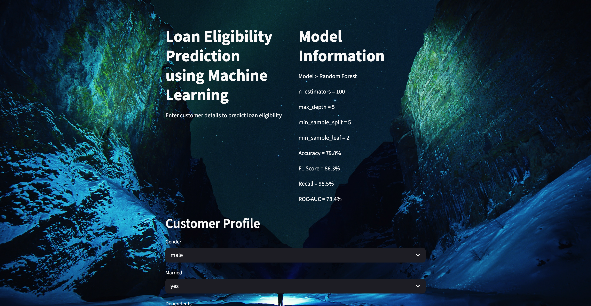

# 🏦 Loan Eligibility Prediction

A Machine Learning project that predicts whether a loan application is likely to be **Approved (Y) or Not Approved (N)** and provides the **approval probability**.

## 🚀 Live Demo

**Streamlit:** [Add your Streamlit link here]  
**GitHub:** [Add your GitHub link here]

## 📊 Dataset

**Loan Prediction Dataset**

Features include customer information, income, loan details, credit history, and property area.

**Target:** `loan_status`

- `Y` → Approved
- `N` → Not Approved

## 🤖 Machine Learning

**Models Tested:**

- Logistic Regression
- Decision Tree
- Random Forest
- KNN
- SVM
- Naive Bayes

**Final Model:** Random Forest Classifier

**Hyperparameter Tuning:** `GridSearchCV`

### Best Parameters

## 📈 Performance

| Metric | Score |
|---|---:|
| Accuracy | **79.8%** |
| F1 Score | **86.3%** |
| Recall | **98.5%** |
| ROC-AUC | **78.4%** |

## 🧹 Preprocessing

- Data Cleaning
- Missing Value Handling
- Exploratory Data Analysis
- Label Encoding
- One-Hot Encoding
- Feature Selection
- Train/Test Split
- Feature Importance

## 🔄 Pipeline

```text
Data → Cleaning → EDA → Preprocessing
→ Model Training → GridSearchCV → Evaluation
→ Random Forest → Loan Probability
→ Loan Status/
## 🔍 Feature Importance

Top features:

1. Credit History
2. Applicant Income
3. Loan Amount
4. Coapplicant Income
5. Loan Amount Term

## 🌐 Streamlit App

The application allows users to enter:

- Customer Profile
- Financial Information
- Credit History
- Property Area

The application returns:

**Loan Status:** `Y / N`  
**Approval Probability:** `%`

## 🧠 Challenges & Learning

During development, I worked through practical Machine Learning issues including:

- Managing separate `LabelEncoder` objects for categorical columns
- Keeping training and prediction preprocessing consistent
- Handling feature-order mismatches
- Removing `loan_id` and `loan_status` from prediction inputs
- Saving and reusing the trained model and encoders with Joblib

## 💾 Saved Files

```text
loan_prediction_model.joblib
label_encoder.joblib
onehot_encoder.joblib

🛠️ Tech Stack
Python · Pandas · NumPy · Scikit-learn · Matplotlib · Seaborn · Streamlit · Joblib · Git

## 📸 Application



👨‍💻 Author
Dakshvir Sharma
Data Science & Machine Learning
